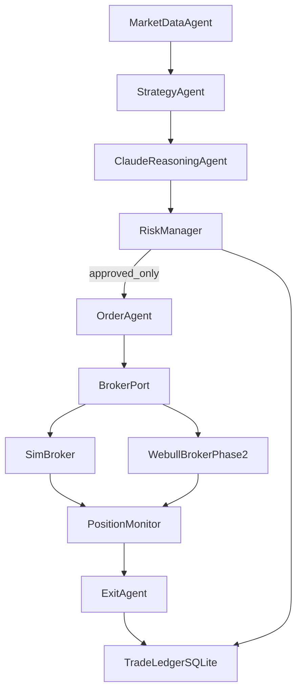

# Simulation-First Webull Options Bot Plan

## Scope And Principles
- Build **paper/sim first**, no live order path enabled by default.
- Enforce **hard-coded risk gates** before any order leaves the system.
- Use **rules-driven entries/exits**; Claude provides confidence/chop assessment and explanation only.
- Keep broker/data integrations abstract so Webull can be added in Phase 2 without strategy rewrites.

## Target Repository Structure (new)
- Backend service: [`/Documents/wetrade/backend`]( /Documents/wetrade/backend )
- API layer: [`/Documents/wetrade/backend/app/api`]( /Documents/wetrade/backend/app/api )
- Trading domain: [`/Documents/wetrade/backend/app/trading`]( /Documents/wetrade/backend/app/trading )
- Risk engine: [`/Documents/wetrade/backend/app/risk`]( /Documents/wetrade/backend/app/risk )
- Simulation broker: [`/Documents/wetrade/backend/app/brokers/sim`]( /Documents/wetrade/backend/app/brokers/sim )
- Future Webull adapter: [`/Documents/wetrade/backend/app/brokers/webull`]( /Documents/wetrade/backend/app/brokers/webull )
- Data providers: [`/Documents/wetrade/backend/app/market_data`]( /Documents/wetrade/backend/app/market_data )
- Persistence (SQLite): [`/Documents/wetrade/backend/app/storage`]( /Documents/wetrade/backend/app/storage )
- Runtime jobs/loops: [`/Documents/wetrade/backend/app/runtime`]( /Documents/wetrade/backend/app/runtime )
- Dashboard (light MVP): [`/Documents/wetrade/dashboard`]( /Documents/wetrade/dashboard )

## System Flow

## Phase 1: Simulation MVP (implement first)
- **Runtime and API**
  - FastAPI app with endpoints: health, account snapshot, positions, open orders, recent trades, risk status, kill-switch toggle, run/pause loop.
  - Background loops:
    - signal loop (every 1 min)
    - position monitor loop (every 5-15 sec)
    - order timeout cleanup (15-30 sec cancel policy)
- **Signal engine (rules-only)**
  - Inputs: SPY/QQQ 5-min candles, VWAP, MA(5/10/20), day high/low, volume spike, option chain spread check.
  - Entry criteria:
    - CALL: price>VWAP, break prev 5-min high, MA5>MA10>MA20, volume expansion, spread<=10%
    - PUT: price<VWAP, break prev 5-min low, MA5<MA10<MA20, volume expansion, spread<=10%
- **Contract selector**
  - Restrict to SPY first, 0DTE/1DTE, delta 0.35-0.55, liquidity threshold (volume/OI), spread<=10%.
- **Order handling**
  - LIMIT orders only.
  - Single contract max.
  - Unfilled cancel after configurable timeout.
- **Risk manager (hard gates)**
  - max trades/day=3
  - max daily loss in test band (configurable default 150)
  - max loss/trade=25%
  - take profit default=40%
  - trailing stop activates at +20%
  - stop new entries after 2 consecutive losses
  - no trades first 10 min / last 20 min session
  - forced flat before close
  - no averaging down
- **Claude role (non-authoritative)**
  - Claude receives structured context + rule result.
  - Returns: confidence, chop warning, rationale, anomaly flags.
  - Claude cannot bypass risk denials; risk engine is final authority.
- **Persistence (SQLite)**
  - Tables: market_snapshots, signals, order_intents, risk_decisions, orders, fills, positions, pnl_snapshots, agent_events.
  - Store every risk decision + rationale for audit.
- **Dashboard MVP**
  - Minimal UI for: mode (SIM only), P&L, open positions, trade log, risk state, kill-switch, last agent decisions.

## Phase 2: Webull integration (behind same interfaces)
- Add Webull market-data adapter and broker adapter using official SDK.
- Keep option orders constrained to Webull-supported options types and limit-based behavior.
- Reuse same RiskManager + Strategy + Runtime loops unchanged.
- Add environment-gated mode switch: `SIM` / `WEBULL_PAPER` / `WEBULL_LIVE`.

## Promotion Gates (SIM -> Live)
- Minimum 50 completed simulated trades before live consideration.
- Pass thresholds (configurable, defaults):
  - win rate >= 45%
  - profit factor >= 1.2
  - max drawdown <= 8%
  - no risk-policy violations in last 30 trades
- Start live at smallest size (still 1 contract cap) with same daily guardrails.

## Security, Ops, and Safety
- `.env.example` with explicit required vars (Claude key, mode flags, session times).
- API key validation on startup; fail fast if missing in active mode.
- Structured JSON logging for every decision path.
- Daily reset job for trade counters/loss limits.
- Global kill-switch endpoint and startup-safe default (`trading_enabled=false`).

## Testing Strategy
- Unit tests: indicator calculations, entry/exit logic, risk checks, contract filter, P&L math.
- Scenario tests: trend day, chop day, spread blowout, late-session signal, consecutive losses.
- Integration tests: signal->risk->order pipeline with simulated fills.
- Regression suite for risk policy to ensure no bypasses.

## Build Order (execution sequence)
1. Scaffold backend app + config + SQLite models.
2. Implement strategy/risk domain models and interfaces.
3. Implement simulation broker + order/position monitor loops.
4. Add Claude reasoning client with strict schema output.
5. Expose FastAPI endpoints for control and observability.
6. Build lightweight dashboard.
7. Add tests and simulation run scripts.
8. Add Webull adapter stubs (non-live) for Phase 2 readiness.

## Explicit Non-Goals In MVP
- No SPX live trading.
- No multi-contract sizing.
- No autonomous risk override by LLM.
- No averaging-down or martingale behavior.
